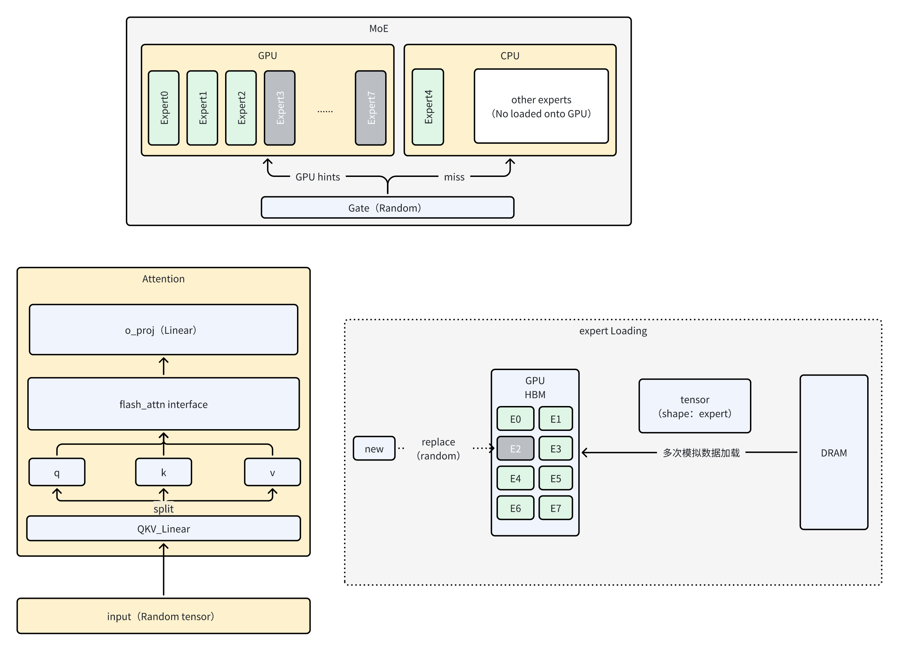

# 项目说明
本项目计划实现一个Llama-like的MoE LLM模拟器，针对MoE模型中的计算、传输进行模拟
目前架构上有问题，未来等待架构重构

# TODO
 - [ ] 适配decode、kv cache
 - [ ] 适配不同的参数组合，测试不同的场景
 - [ ] 架构重构：抽象更高的抽象层，更灵活配置: 多用户、多batch

# 进度/更新日志 
 - [x] 2026.1.9 实现 prefill阶段的模拟: Attention、Expert计算、数据传输模拟
 